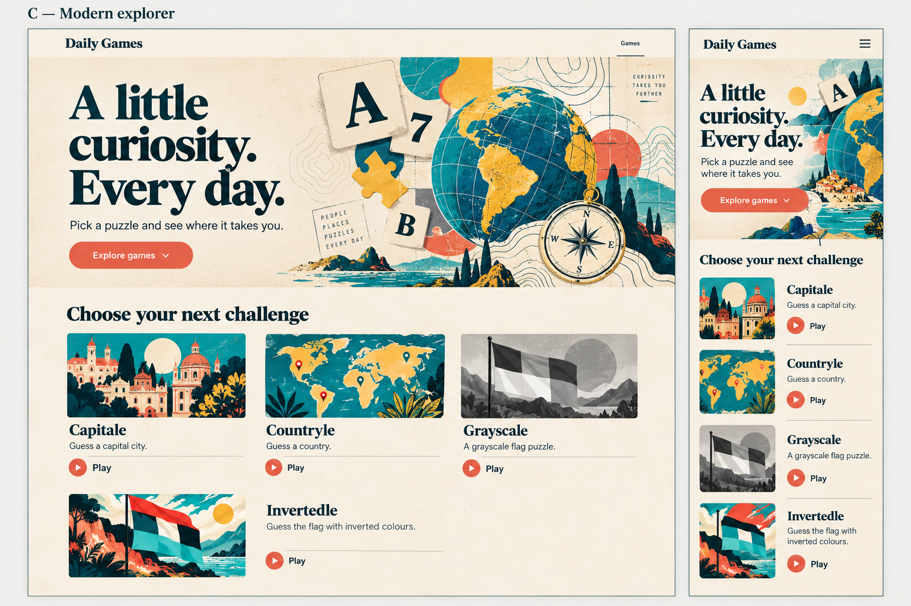

# Landing page: Modern explorer

Approved direction: 2026-10-01. Implementation, testing, commit, push, and PR creation authorized by user instruction on 2026-10-01.

Branch: `design/modern-explorer-landing`.
Baseline: `a5742c4` on `main`.

## Objective and scope

Replace the landing page's purple gradient, emoji artwork, and generic cards with an illustrated, editorial game collection. Establish a mood before presenting the games. Design for desktop first, with a deliberate mobile adaptation and a catalogue that can grow beyond four games.

The user selected concept C, Modern explorer: warm paper, expressive serif typography, vivid illustrations, and subtle map details. Keep the globe and compass prominent in the hero. Future games can be about words, numbers, logic, or other subjects; the hero can be adjusted later as the collection changes.

Scope is the landing page only, including the static image-copy rule needed to serve its local assets. Game pages, gameplay, APIs, deployment, and shared branding are outside this redesign.

## Visual reference

This generated concept is an art-direction reference, not a flattened image to use as the website. Build real HTML text and links; produce separate decorative hero and game illustrations. The catalogue in the finished page uses one consistent entry layout, including the fourth entry. The reference's mobile hamburger is replaced by a direct Games link because there is only one navigation destination.

The other explored directions were a vintage field journal and a bold illustrated playground. C combines the journal's atmosphere with contemporary color and artwork.

## Visual language

- Background: warm ivory with restrained paper grain. Texture stays behind content and does not impair reading.
- Text: deep petrol. Coral highlights the primary action; teal and sunflower yellow appear in illustrations.
- Typography: Fraunces for headings and DM Sans for descriptions and controls, self-hosted as WOFF2 with Georgia and Avenir-family fallbacks.
- Composition: generous whitespace, strong hierarchy, fine separators, and illustrated entries sitting on the page rather than heavy elevated panels.
- Artwork: screenprint-like color, globe, compass, contour lines, and small letter/number/puzzle elements. Geography remains the dominant hero motif. Each game's thumbnail communicates its own subject.
- Define palette, spacing, and type scale as landing-local CSS variables. Final color values must satisfy contrast checks.

## Content and page structure

1. Compact header with Daily Games branding and a Games link to the catalogue.
2. Illustrated hero with one main heading, supporting copy, and a catalogue jump link.
3. Game catalogue with a section heading and repeatable game entries.

Approved concept copy:

- Brand: **Daily Games**.
- Hero heading: **A little curiosity. Every day.**
- Supporting copy: **Pick a puzzle and see where it takes you.**
- Hero action: **Explore games**.
- Catalogue heading: **Choose your next challenge**.

Initial catalogue, preserving the current order and destination names:

| Game | Description | Artwork subject | Destination name |
| --- | --- | --- | --- |
| Capitale | Guess the capital city from geographic clues | Illustrated city architecture | `capitale` |
| Countryle | Identify the country using hints | Map and location motifs | `countryle` |
| Grayscale | Name the country from its grayscale flag | Monochrome flag | `grayscale` |
| Invertedle | Recognize the flag with inverted colors | Flag with unexpected colors | `invertedle` |

Illustrations are decorative examples, not today's puzzle answers. Keep descriptions accurate to the current games. Do not imply that word or number games already exist. Every entry offers a clear Play action.

## Desktop and mobile layout

### Desktop

Use a centered, comfortably wide page, approximately 1200px of content at large viewport sizes. The hero places copy on the left and a substantial illustration on the right. Maintain open space around the headline and keep decorative art clear of text.

Below the hero, use three equal catalogue columns. Each entry has an illustration, title, description, and Play action in the same order. New games continue into further rows. An incomplete last row stays naturally aligned; decorative filler and coming-soon entries are unnecessary.

### Tablet

Reduce spacing and use two catalogue columns when three would constrain the artwork or labels. Stack the hero when the copy and illustration cannot sit beside each other comfortably.

### Mobile

Stack hero copy and a smaller, recomposed illustration. Preserve the mood while bringing the catalogue into reach with an ordinary scroll; do not force a full-screen hero. A starting hero height budget is approximately 420–480px beneath the header on a 390px-wide phone, adapting freely to text size and short screens.

Catalogue entries become horizontal rows with a thumbnail beside the title, description, and Play action. At narrow widths or enlarged text, allow the entry to stack vertically. No horizontal scrolling, clipped labels, overlapping artwork, fixed-height text containers, or hover-dependent information.

Choose breakpoints based on content fit during implementation, rather than matching device names. Review at 320, 390, 768, 1024, and 1440px widths.

## Catalogue contract and states

Keep the existing static HTML approach: one repeatable `a.game-tile` entry per game. Required entry content is a destination, title, description, and illustration. Adding a game consists of appending an entry and supplying its thumbnail, without changing grid definitions, positional selectors, or hero composition.

Use one link per entry; the visible Play treatment is part of that link, not a nested interactive element. Preserve useful link text containing the game name. Hover and keyboard focus emphasize the actionable entry with restrained color or underline changes. Active feedback is subtle. The page does not need loading, selection, completion, account, or statistics states.

Retain the existing environment-aware link rewrite using `/shared/env.js` and `siteUrl`. Production and test destinations must remain correct. Preserve `a.game-tile` compatibility with the existing smoke checks.

The page must remain useful if images fail or fonts do not load: text links and descriptions stay visible, and reserved artwork dimensions prevent disruptive layout shifts. Use local optimized artwork, with appropriate responsive sizing. Prefer a small hero asset and thumbnails over shipping the entire reference board.

## Accessibility and interaction

- Use semantic header, main, section, headings, and anchors. One hero `h1`, a catalogue `h2`, and game titles at the next level.
- Give decorative artwork empty alternative text; the adjacent text provides the game identity. Texture and contour decorations stay out of the accessibility tree.
- Keep normal text at least 4.5:1 contrast, large text at least 3:1, and focus/control indicators at least 3:1 against adjacent colors.
- Provide visible keyboard focus, logical tab order, a skip link, and practical touch targets of at least 44px.
- The Games and Explore games links target the catalogue heading. Avoid a decorative menu with no useful destinations.
- Use minimal motion. Respect reduced-motion preferences for any transitions or scroll behavior; no parallax, looping animation, or moving hero is needed.
- Support 200% text enlargement and reflow at a 320 CSS-pixel width. Verify text resizing independently of screenshots.

## Proposed implementation sequence

Implementation was completed under the user instruction dated 2026-10-01.

1. Run the existing unit and browser suites and record baseline results. Resolve or report starting failures before changing code.
2. Prepare a standalone hero illustration and four thumbnails matching the reference. Select fonts and contrast-compliant palette values.
3. Extend landing browser coverage for semantic content, catalogue navigation, and test-host destinations; keep the existing four-game smoke check for today's catalogue.
4. Rework `landing/index.html` and `landing/style.css` using the existing static structure and link contract. Update the landing favicon to fit the approved palette if needed.
5. Add browser checks for phone reflow, keyboard navigation, and catalogue expansion using temporary extra entries and long labels. Test 1, 4, 5, and 12 entries without publishing fictional games.
6. Review desktop, tablet, and mobile rendering against this design, then run the existing full local suites. Perform an independent WCAG 2.2 AA accessibility review with keyboard and browser interaction checks; record any assistive-technology checks that could not run.
7. Update this document with final fonts, palette, asset paths, responsive decisions, and actual verification evidence.

Expected affected files:

- `landing/index.html`: semantic structure, approved copy, illustration references, repeatable game entries, environment-aware links.
- `landing/style.css`: landing-local design tokens, typography, hero, responsive catalogue, focus and reduced-motion styles.
- `landing/assets/`: new hero and game illustration files; final filenames chosen during implementation.
- `tests/e2e/smoke.spec.js`: landing interaction and layout coverage using the existing Playwright setup.
- `static/Dockerfile`: copy landing artwork and fonts into the existing `/assets/` URL tree.
- This design document: final implementation details and verification record.

No new framework, UI library, catalogue service, or game registry is required. Keep `/shared/env.js` as the existing destination helper.

## Acceptance and verification

- Visually matches C's warm ivory, petrol text, coral actions, and illustrated explorer atmosphere.
- Hero establishes the mood before the catalogue, with a prominent globe and compass on desktop and an adapted composition on mobile.
- All four real games are present with correct descriptions and working environment-specific links.
- Catalogue layout works with additional games and longer content without bespoke layouts for individual positions.
- Games and Explore games navigate to the catalogue; each entry works by keyboard and touch.
- Layout reflows at the specified widths and with enlarged text; illustrations do not obscure content.
- Accessibility checks cover semantics, link names, focus, contrast, reflow, targets, and reduced motion. Automated results alone do not establish full compliance.
- Run `rtk npm test` and `rtk npm run test:e2e` during implementation. The browser suite uses Docker through `playwright.config.js`, so Docker and the Playwright browser runtime must be available. Its test server uses port 8080 and the `sdg-static-e2e` container name.
- Game pages receive no visual or behavioral changes.

## Implementation record

### Design decisions

- Local fonts: Fraunces variable serif and DM Sans variable sans-serif, with their SIL Open Font Licenses included in `landing/assets/`.
- Palette tokens: paper `#f5f0e5`, ink `#103b3d`, secondary ink `#49605f`, coral `#b93f2c`, teal `#226e6d`, and sunflower `#efbf43`.
- Measured contrast ratios: ink on paper 10.77:1, secondary ink on paper 5.92:1, coral action on paper 4.85:1, white on coral 5.42:1, white on teal 5.97:1, and teal on paper 5.25:1.
- Artwork: `landing/assets/explorer-hero.webp`, `capitale.webp`, `countryle.webp`, `grayscale.webp`, and `invertedle.webp`. Hero is about 490 KB; each thumbnail is about 100 KB. Images are decorative and use empty alt text.
- The existing static server maps `/assets/*` to `/srv/assets/*`; the Dockerfile copies page-specific files to `/srv/assets/landing/` so the browser can load them without changing that shared route.
- Responsive rules use three catalogue columns above 900px, two from 621–900px, horizontal rows at 360–620px, and stacked entries at 360px and below. The hero stacks below 620px.
- Main is a focus target for the skip link. Reduced motion disables smooth scrolling and transitions.

### Verification

- `rtk npm test`: 6 passed.
- `rtk npm run test:e2e` with the Colima Docker socket: 18 passed. Coverage includes the four-game smoke check, production and test-host link destinations, semantic copy, catalogue navigation, keyboard skip/focus flow, 200% text enlargement at 320px, catalogue sizes of 1/4/5/12 at 320/390/768/1024/1440px, and existing game flows.
- The live page was inspected in Chrome at 320, 390, 768, 1024, and 1440px. Images and both fonts loaded. Production and test-host links were checked; Games, Explore games, and the keyboard skip link were activated.
- No horizontal overflow was reported at the target widths or at 200% text enlargement. WCAG contrast calculations meet AA for normal text and controls.
- Manual testing with a screen reader and other assistive technologies was not available; automated/browser checks do not establish full assistive-technology conformance.
